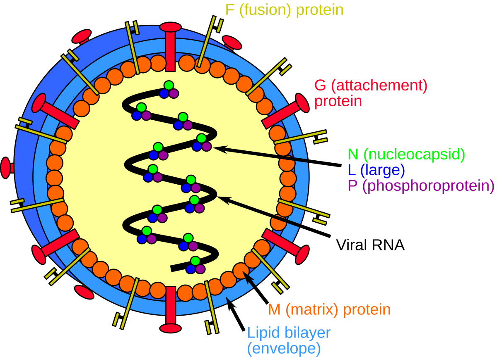

<p align="center">
  
</p>

# 🧬 Adaptyv Bio – Nipah Binder Competition

## 🎯 Task
Design a **protein binder** to neutralize **Nipah virus (NiV)** by targeting its **glycoprotein G (NiV-G)**.

**Target structure:** [PDB 2VSM](https://www.rcsb.org/structure/2VSM)  
Focus: Extracellular domain (residues 71–602)

---

## 🗓️ Key Dates
- 🧩 **Submission deadline:** 24 Nov 2025  
- 🔬 **Experimental phase starts:** 1 Dec 2025  
- 🏁 **Results:** 6 Jan 2026  

---

## 🧠 Selection (1,000 Designs)
- **600** by top *ipSAE* scores (Boltz2)  
- **200** by community votes  
- **200** by expert review (novelty & originality)

---

## 💡 Notes
- Originality encouraged — novel scaffolds perform better.  
- Unclear glycosylation and expression system (mammalian / yeast / bacterial).  
- Optimize for binding affinity, stability, and solubility.

---

## 🔗 Reference
[Competition Page](https://proteinbase.com/competitions/adaptyv-nipah-competition)


# Download Files
```
git clone https://github.com/profdocpizza/adaptyv_nipah_competition.git
cd adaptyv_nipah_competition
```
download relevant crystal_structures:
```
bash download_crystal_structures.sh
```
read what they are in [crystal_structures.md](crystal_structures.md)

